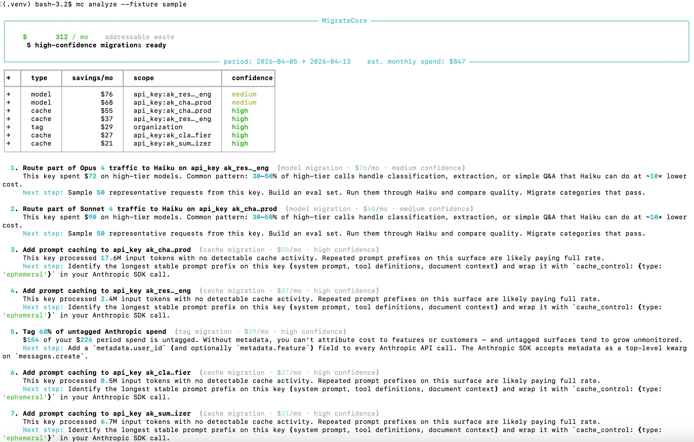

# MigrateCore

> Find waste in your Anthropic API spend. Get a ranked migration plan in 30 seconds.



MigrateCore reads your Anthropic API usage via the official Admin API and produces a ranked, dollar-denominated list of changes you can make to cut your bill: prompt caching opportunities, model downgrade candidates, batch API workloads, untagged spend, and duplicate prompts.

It does **not** sit in your API request path. It does **not** store your prompts. It does **not** modify your code. It reads aggregates, runs heuristics, prints a plan.

## Install

```bash
pipx install migratecore
```

Or via pip:

```bash
pip install migratecore
```

Verify:

```bash
mc version
# migratecore 0.1.1
```

## Use

```bash
export ANTHROPIC_ADMIN_KEY=sk-ant-admin01-...
mc analyze
```

The Admin key is created in the Anthropic console → **Settings → Admin Keys**. It is *not* the same as a regular API key. You need org owner or admin permissions to create one.

Try the demo without an Anthropic account:

```bash
mc analyze --fixture sample
```

Output as structured JSON for piping into other tools:

```bash
mc analyze --format json
```

## What it detects

| Migration | Detection signal | Confidence |
|---|---|---|
| **Cache** | High input-token volume on a key with no cache activity | High |
| **Model** | Heavy Sonnet/Opus traffic likely suitable for Haiku downgrade | Medium — recommend, never auto-apply |
| **Batch** | Async/non-interactive workloads not on the Batch API | Medium |
| **Tag** | Spend without `metadata` field — blocks per-feature attribution | High |
| **Dedup** | Identical request bodies within a 1h window | High |

Each finding ships with a dollar estimate, an effort estimate, and a verification step.

## What it isn't

- Not a runtime proxy (no latency, no trust surface in your request path)
- Not multi-provider — Claude-native by design. If you need cross-provider observability, [Helicone](https://helicone.ai) and [Langfuse](https://langfuse.com) are good options
- Not an evaluation framework. MigrateCore recommends migrations; you run the evals that prove a model downgrade is safe for your workload
- Not auto-applying. Plans only. Humans approve every change.

## How it works

MigrateCore calls the Anthropic Admin API endpoint `/v1/organizations/usage_report/messages` with a 30-day window, normalizes the per-day-per-key aggregate buckets into a typed model, and runs a small set of heuristics. Each heuristic produces zero or more `Migration` recommendations with conservative dollar estimates. Period savings are scaled to monthly using the actual observed window.

Heuristic thresholds are intentionally conservative — missing an opportunity costs less than overstating one and losing the user's trust on the first run.

## Status

**v0.1.1 (alpha).** Three migration heuristics shipped (cache, model, tag); two more (batch, dedup) coming in 0.2 once richer per-request data is available. Spec, architecture, and roadmap in [`docs/SPEC.md`](docs/SPEC.md).

## Roadmap

- `mc plan <type>` — detailed code-level migration plan with diff suggestions
- HTML report (`mc report --format html`) for emailing to CFOs
- Continuous monitoring + per-customer chargeback (paid hosted version)

## Contributing

Issues and PRs welcome. See [`CONTRIBUTING.md`](CONTRIBUTING.md). New heuristics need a discussion issue first — confidence calibration matters more than coverage.

## License

CLI is licensed under [Apache 2.0](LICENSE). The hosted Cloud version (planned) will be proprietary.

---

*MigrateCore is an independent project and is not affiliated with Anthropic, PBC. Claude® is a trademark of Anthropic, PBC.*
